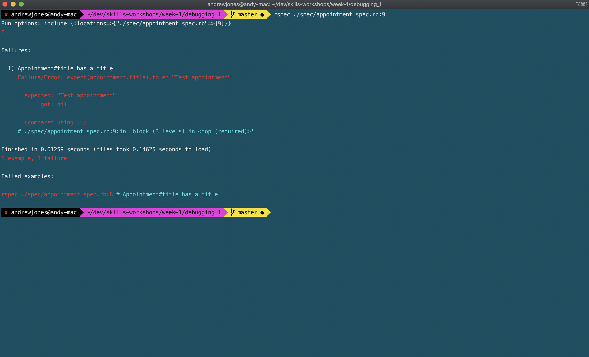
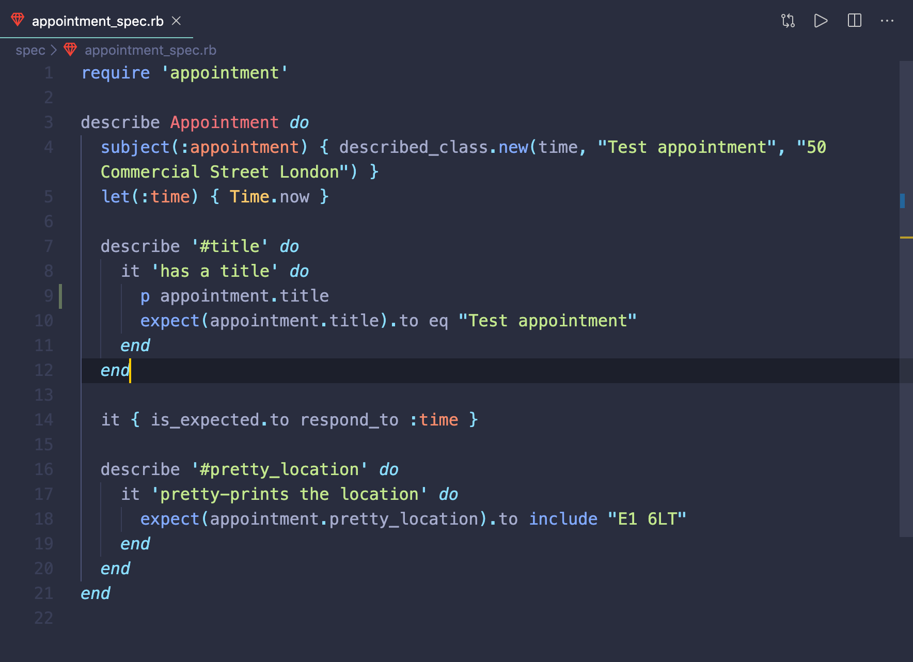
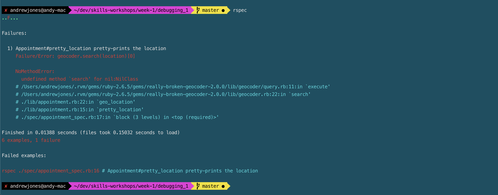
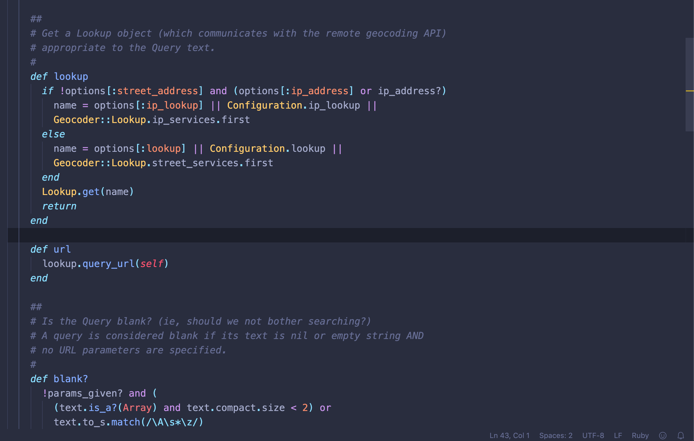

# Week 1 goals

By the end of the week I will be able to:

1. **Test-drive a simple program using objects and methods.** :white_check_mark:
2. **Pair using the driver-navigator style.** :white_check_mark:
3. **Follow an effective debugging process.** :white_check_mark:
4. **Describe some basic OO principles like encapsulation, SRP.** :white_check_mark:

## Evidence

1. **Test-drive a simple program using objects and methods.**

    * **Boris-Bikes** - Weekly challenge demonstrating different stages of unit and feature tests. All code written test first. Completed as a pairing exercise [here](https://github.com/mattfreeman-london/boris-bikes) and as a solo effort [here.](https://github.com/jonesandy/boris-bikes)
    * **Airport** - Weekend solo challenge tackled using TDD practises. Tests written first to drive production code. Repository [here](https://github.com/jonesandy/airport_challenge).
    * **Dice-app** - Simple one method program to begin TDD mindset. Uses srand for random behaviour stubbing. Repository [here](https://github.com/jonesandy/dice-app).
    * **TDD Exercises** - Folder of TDD exercises using examples from the course, websites and Codewars katas. Repository [here](https://github.com/jonesandy/tdd-exercises).

2. **Pair using the driver-navigator style.**

    * **Boris-Bikes** - Weekly challenge completed as a pairing exercise [here](https://github.com/mattfreeman-london/boris-bikes).

3. **Follow an effective debugging process.**

    * Worked through [Debugging 1](https://github.com/jonesandy/skills-workshops/tree/master/week-1/debugging_1) workshop. Discovered three spelling mistakes by reading through each failing test. Working up through the stack trace to find where the errors were. Last error was in gem. 
    
    
4. **Describe some basic OO principles like encapsulation, SRP.**

    * **Encapsulation** - My example and explanation of encapsulation and SRP. Uses three classes to demonstrate and also includes write up in README file. Repository [here](https://github.com/jonesandy/encapsulation).
    * **Calculator** exercise from the skills workshop material. Extracted own class to show cohesion in class and single responsibility principle on each method. Code found [here](https://github.com/jonesandy/calculator-excercise).
  

## Next week goal

Ask a cohort member to validate and review a piece of my code.

Keep a more detailed weekly goals sheet. Add reflections at the end of the week.

---
    
[Home](https://github.com/jonesandy/learning-goals)    
[Next Week](https://github.com/jonesandy/learning-goals/blob/master/week2/week2.md)  
