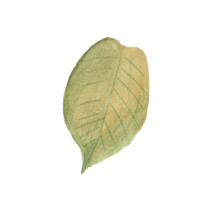

# Week 11 and 12 goals

By the end of the project I will be able to:

1. **Use high-quality processes to build an extended project in a team** :white_check_mark:

## Evidence

----

### Project GreenPrint

For this project we decided to break it into two apps. We built a frontend app that would connect to our backend app. 

[Frontend](https://github.com/jonesandy/Project_Greenprint_Frontend) app repository.  Live app located [here](https://project-greenprint.herokuapp.com/).

[Backend](https://github.com/jonesandy/Project_Greenprint_Backend) app repository with details on how to use it.

---

[Previous Week](https://github.com/jonesandy/learning-goals/blob/master/week8-9/week8-9.md)     
[Home](https://github.com/jonesandy/learning-goals)    
