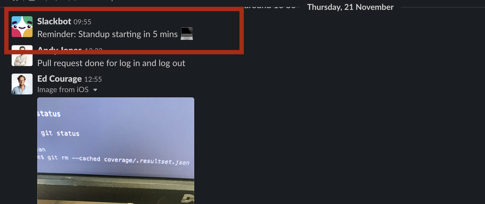
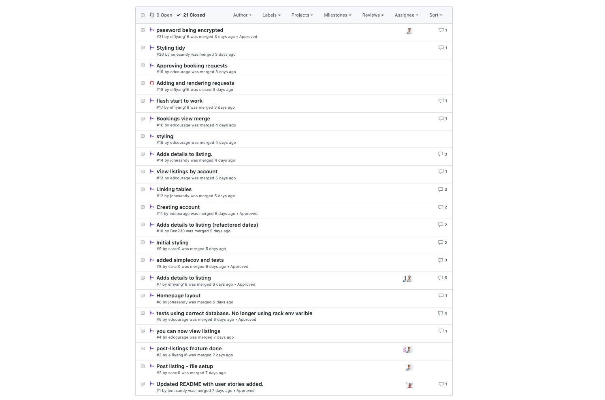

# Week 6 goals

By the end of the week I will be able to:

1. **Break down projects into tasks and allocate them to pairs.** :white_check_mark:
2. **Build to a specification (rather than challenges).** :white_check_mark:
3. **Run stand-ups and retrospectives.** :white_check_mark:
4. **Use a branch/PR/merge git workflow.** :white_check_mark:
5. **Give and receive meaningful code review.** :white_check_mark:

## Evidence
[MakersBnB](https://github.com/jonesandy/makersbnb)

1. **Break down projects into tasks and allocate them to pairs.**
    * Creating [these](https://github.com/jonesandy/makersbnb#user-stories) user stories from the specification.
    * Effective use of Trello to manage these tasks and assign to team members/pairs. 

2. **Build to a specification (rather than challenges).**
    * Turning the [list](https://github.com/makersacademy/course/blob/master/makersbnb/specification_and_mockups.md) of specifications into [user stories](https://github.com/jonesandy/makersbnb#user-stories).

3. **Run stand-ups and retrospectives.**
    * Daily stand-ups run to assign tasks and assess any blockers or project issues. 

4. **Use a branch/PR/merge git workflow.**
    * Use of branch for each user story. Once feature complete pull request sent and team member code reviews. 
    * [108](https://github.com/jonesandy/makersbnb/commits/master) commits across branches.

5. **Give and receive meaningful code review.**
    * Code reviews on [each](https://github.com/jonesandy/makersbnb/pull/7) pull request, with code comments before approval to merge.
    

## Project reflection

### What went well

I think as a team we worked very well and cohesively. From the start we decided to focus on making sure our project management was strong to avoid any issues further down the line. We created a project board that allowed us to track user stories and tasks. We could assign them to people for the day and it would show the status of any pull requests or branches being worked on. It really helped that we spent time working on user stories at the start and defining what our MVP would be. This allowed us to prioritise the tasks each day in our stand-ups.

We communicated well and made sure we all knew what the team was working on. Utilising our strengths in the team to help when pairs became blocked or encountered challenges. We followed a good developer flow and made sure we did code reviews on pull requests.  Then after any changes were made we gave the go ahead to merge into master.

As a team we never worked on a feature that didn't get implemented. And when we were working on a feature, the finished product went across the full stack. This meant there was very little "dead" branches.

### What could have gone better

Even though we started very organised we rushed straight into coding and didn't think through the proper project setup. We should have created a "base" project before branching off from there. This meant we wasted time doing similar work at first. This wasn't the best use of resources. We could have spent more time defining naming conventions and project style.

Acceptance criteria is one area that we didn't follow through on. We could have defined more explicitly what meant a user story was complete. This meant some areas either didn't get completed thoroughly or spilled over into other user stories. Define acceptance criteria would have stopped this.

Our user stories could have been more concise and not encompassing more features than needed. Some of them started as Epics and needed to be broken down to more specifics.

### Change for next project

* Define project outline and setup before starting to branch.
* Define tech stack at the beginning.
* Acceptance criteria on every user story before starting to work on it.
* Small chunks to work on.
* Style guide defined for names and variables.
* More check-ins regarding blockers.

---

[Previous Week](https://github.com/jonesandy/learning-goals/blob/master/week5/week5.md)     
[Home](https://github.com/jonesandy/learning-goals)    
[Next Week](https://github.com/jonesandy/learning-goals/blob/master/week7/week7.md)    
